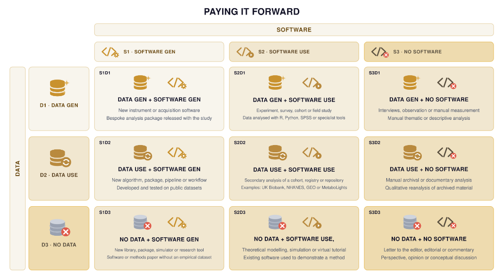

# paying-it-forward

**How are research outputs changing in the age of AI?**

This project aims to build a metric or set of criteria that describes whether a piece of research generates new research artefacts and what kind of artefacts are produced.

For this project, we have limited the scope to only software and data. Arguably, there are many types of research artefact such as a new theoretical methodology, hardware or protocols.



## Spike 0

Spike 0 (`spikes/2026-05-llm-cost/`) tested classification cost and schema
on 30 UK papers with frontier LLMs (write-up:
[`proposal-llm-budget.md`](spikes/2026-05-llm-cost/proposal-llm-budget.md)).
`classify_papers.py` builds on that as a reusable tool: it classifies a
dataset of papers into S\*D\* categories, one run per invocation, with
results collected under `Experiments/`.

###  Getting the data

The paper corpus isn't committed (mixed licences). Rebuild it from
`spikes/2026-05-llm-cost/papers_manifest.csv`:

```
cd spikes/2026-05-llm-cost
python -m venv .venv && .venv/bin/pip install -r requirements.txt
.venv/bin/python fetch_corpus.py   # writes papers/papers_fulltext_30.json (and _10, .json)
```

To also download the source PDFs (PMC Open Access papers only, keyed by
PMCID):

```
.venv/bin/python download_pdfs.py   # writes papers/pdfs/*.pdf
```

## Classifying papers

`classify_papers.py` classifies each paper in a dataset into one of nine
S\*D\* categories (see `criteria.md`), using either a local Ollama model or
the Claude API. Papers are processed one at a time with no shared context
between them, and results are written incrementally as it goes.

### 1. Set up `.secrets`

Create a `.secrets` file in the repo root (never committed — it's in
`.gitignore`) with whichever of these your chosen provider needs:

```
OLLAMA_MODEL=gemma4:12b
ANTHROPIC_API_KEY=sk-ant-...
ANTHROPIC_MODEL=claude-sonnet-5
```

For Ollama, make sure the model has been pulled (`ollama pull <model>`) and
the server is running (`ollama serve`).

### 2. Run it

```
python3 classify_papers.py --provider ollama --dataset path/to/papers.json
python3 classify_papers.py --provider claude --dataset path/to/papers.json
```

`--dataset` must point at a `.json` file (a list of paper objects with
`title`/`abstract`/`fulltext` fields, e.g. `spikes/2026-05-llm-cost/papers/papers_fulltext_30.json`).

Useful flags:
- `--limit N` — only classify the first N papers (handy for a quick test)
- `--host` — Ollama server URL, if not the default `http://localhost:11434`
- `--num-ctx` — context window size in tokens for every request, Ollama provider only (default `262144`)
- `--name` — a label for this run, stored in `run.json`

### 3. Find the results

Each run creates a new timestamped folder under `Experiments/`:

```
Experiments/20260918_161014/
  results.json   # one entry per paper: category, reasoning, tokens, timing
  run.json       # run metadata: provider, model, and the exact filepaths used
  criteria.md    # copy of the criteria.md used for this run
  task.md        # copy of the task.md used for this run
```
