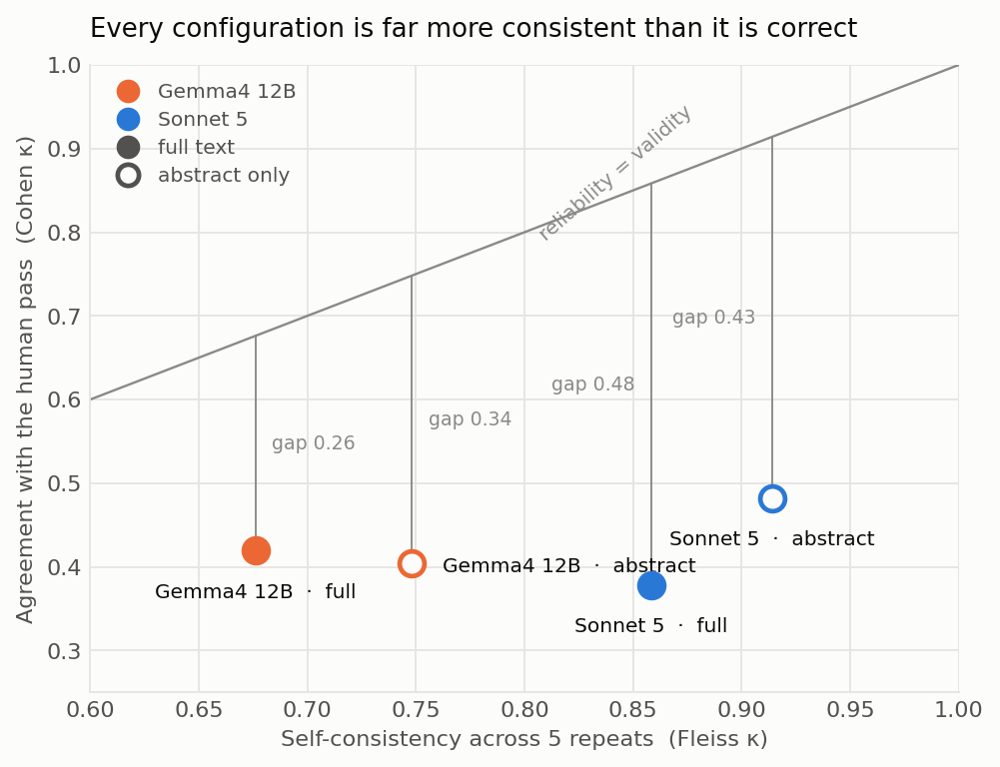
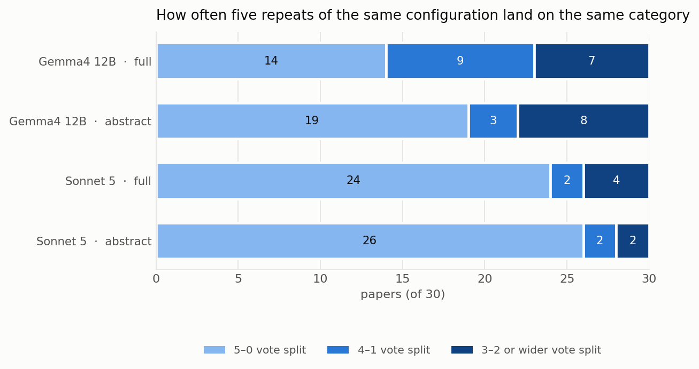
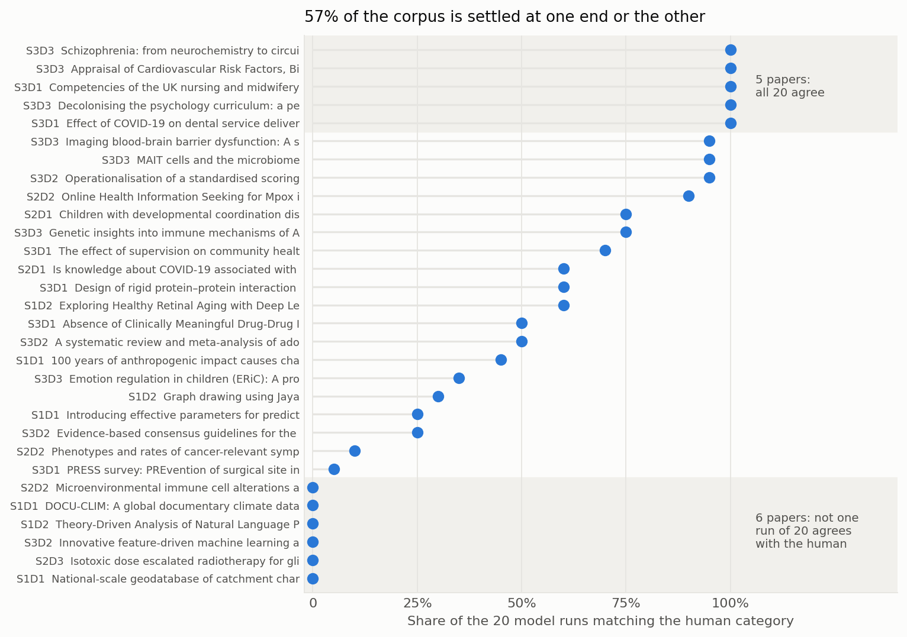
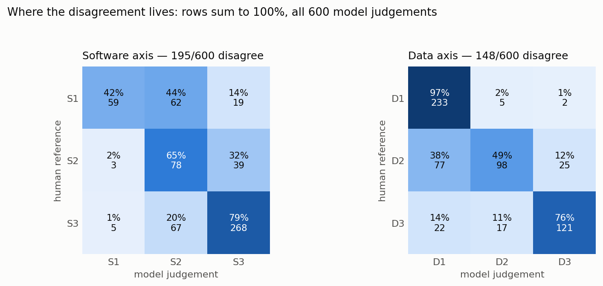
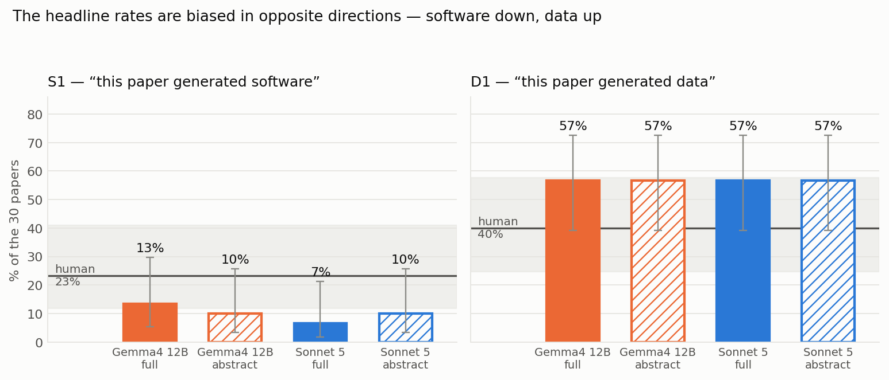
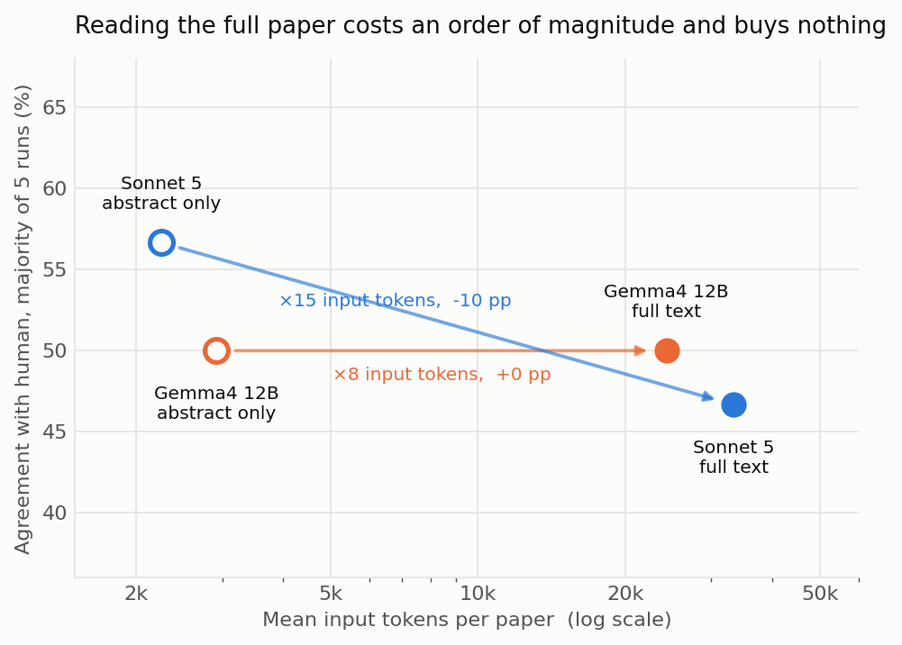
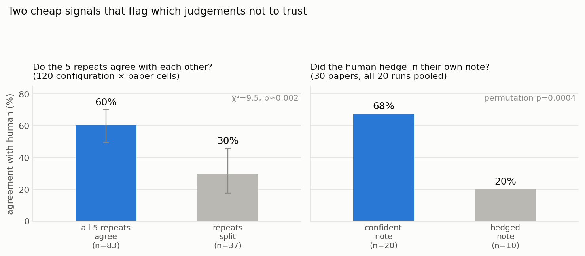
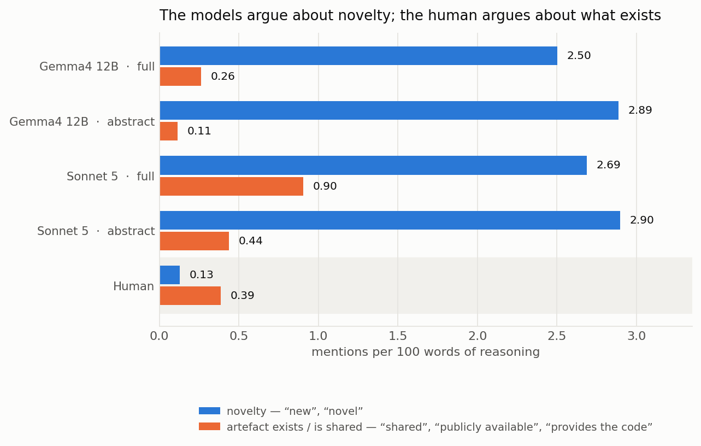
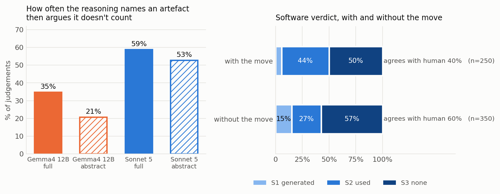
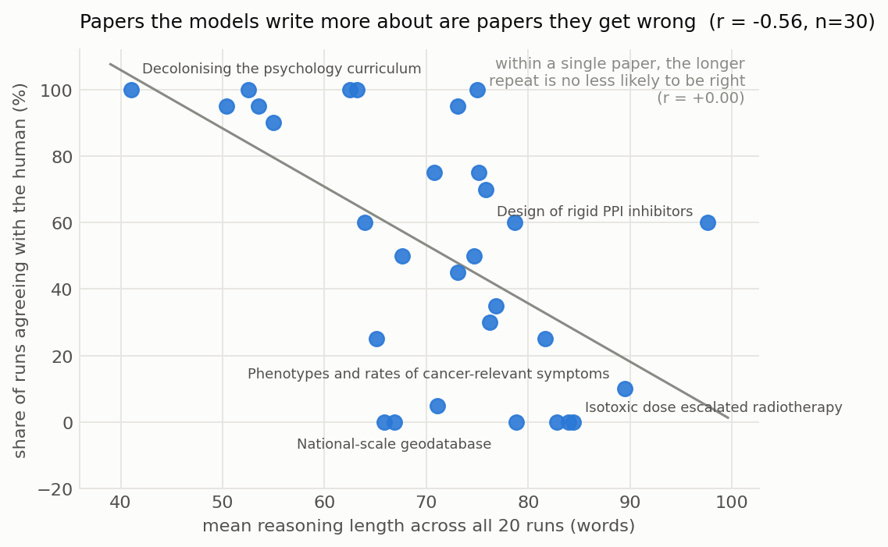

# Are the S\*D\* classifications reliable enough to build a metric on?

This analysis was automated by Claude Code.

**Analysis of every run in `Experiments/` — 21 runs, 630 judgements and their
630 free-text justifications, 30 papers**
**Date**: 22 September 2026
**Reproduce with**: `python3 analysis/analyse_experiments.py` (writes `analysis/figures/` and `analysis/statistics.json`)

> **One-line summary.** The models are highly self-consistent and only about half
> right. Their errors are not noise — they are a shared, directional disagreement
> with the human about where the S1/S2 and D1/D2 boundaries sit, which means more
> repeats, bigger models and full text all fail to fix it, and the headline metric
> the project exists to measure comes out biased in a predictable direction. The
> reasoning text says why: the models run a *novelty* test on software where the
> human runs an *existence* test, and they spend 250 of 600 judgements naming an
> artefact and then arguing it doesn't count.

---

## 1. Headline

| Question | Answer |
|---|---|
| How consistent is a configuration with **itself**? | Very. Fleiss κ 0.68 (Gemma·full) to 0.91 (Sonnet·abstract); Sonnet·abstract returns the identical category on all 5 repeats for 26 of 30 papers. |
| How consistent is it with **the human**? | Barely half. 47–57% exact agreement, Cohen κ 0.38–0.48. Pooled over all 600 model judgements: **51.7%** (cluster-bootstrap 95% CI 38–65%). |
| Is any configuration clearly best? | **No.** Sonnet·abstract is nominally top (57%, κ 0.48) but its CI (39–73%) overlaps every other configuration. With n=30 this experiment cannot rank them. |
| Does reading the **full text** help? | **No, and it may hurt.** It costs ×8 (Gemma) to ×15 (Sonnet) the input tokens for +0 pp and −10 pp respectively (McNemar p=1.0 and p=0.45). Full text systematically converts S3 → S2. |
| Do **repeats or ensembles** help? | **No.** Majority-of-5 ≈ single run (±2 pp), and *every* cross-configuration ensemble scores at or below the best single configuration. The errors are correlated, not random. |
| Where does the disagreement live? | The **software axis**: 195 of 600 judgements disagree on S vs 148 on D. Specifically **S1→S2** (the human's "generated" becomes the model's "used", 44% of human-S1 judgements) and **D2→D1** (the human's "used" becomes the model's "generated", 38% of human-D2 judgements). |
| What does that do to the **metric**? | It biases the two headline rates in opposite directions: "generated software" is understated by 43–71% relative, "generated data" overstated by 42% relative — **in all four configurations**. |
| Is this a model problem or a **criteria** problem? | Mostly criteria. All four configurations agree with each other more than any of them agrees with the human, and the failures cluster on exactly the cases where the human's own note says the call was difficult. |
| Why do the models demote software? | Not because they miss it. In 250 of 600 judgements they name the artefact and then argue it doesn't count ("standard methods", "used as-is", "more a demonstration than"). Those judgements carry an S1 rate of 6% against 15%, and agree with the human 40% against 60%. |
| Are the two sides even asking the same question? | No. Per 100 words of reasoning the models mention novelty 2.5–2.9 times and the human 0.13. The models run a *novelty* test, the human an *existence* test. |
| Anything usable right now? | Three free triage signals. When a configuration's 5 repeats are unanimous it matches the human 60% of the time; when they split, 30% (gap 31 pp, 95% CI 13–46 pp). The 10 papers where the human hedged in writing drew 20% agreement vs 68% elsewhere. And how *long* the models' reasoning is ranks papers by contestedness (r=−0.56 across the 30 papers). |

---

## 2. What is in the data

Four configurations × 5 repeats × 30 papers = 600 model judgements, plus one
manual pass by Edwin over the same 30 papers. The design is balanced: every
configuration saw the same corpus, with the same `criteria.md` and `task.md`,
one paper per request and no shared context.

| Configuration | Input tok/paper | Output tok/paper | s/paper | min per 30-paper run | Reasoning length |
|---|---|---|---|---|---|
| Gemma4 12B · full text | 24,312 | 93 | 45.1 | 22.5 | 58 words |
| Gemma4 12B · abstract only | 2,921 | 76 | 28.5 | 14.3 | 46 words |
| Sonnet 5 · full text | 33,358 | 270 | 4.6 | 2.3 | 102 words |
| Sonnet 5 · abstract only | 2,252 | 212 | 3.4 | 1.7 | 76 words |
| Human (Edwin) | — | — | — | one pass, no repeats | 26 words |

No parse failures, no truncations, no invalid category codes anywhere in the
600 rows — the structured-output schema held up completely. Of the nine
categories, **S1D3 was never used by anyone**, human included.

Two further runs exist in git history but not in the working tree
(`20260918_163231` gemma·full and `20260921_122718_rep6` gemma·abstract). They
are excluded so that all four configurations carry exactly five repeats; adding
them does not change any conclusion below.

---

## 3. Finding 1 — high reliability, low validity



Self-consistency and correctness come apart completely. Every configuration sits
far below the diagonal, and the gap *widens* with consistency: Gemma·full is
0.26 κ points below it, Sonnet·full 0.48. Sonnet·abstract returns the same
category on all five repeats for 26 of 30 papers (Fleiss κ 0.914) while agreeing
with the human on 17 (κ 0.48).

| Configuration | Fleiss κ (self) | Pairwise agr. | Unanimous papers | Mean entropy | κ software axis | κ data axis |
|---|---|---|---|---|---|---|
| Gemma4 12B · full | 0.676 | 74% | 47% | 0.46 bits | 0.785 | 0.772 |
| Gemma4 12B · abstract | 0.748 | 80% | 63% | 0.34 bits | 0.765 | 0.822 |
| Sonnet 5 · full | 0.858 | 89% | 80% | 0.19 bits | 0.900 | 0.911 |
| Sonnet 5 · abstract | 0.914 | 93% | 87% | 0.11 bits | 0.872 | 0.977 |

| Configuration | Single run | Majority of 5 | 95% CI | Cohen κ | S exact | D exact | κ_S | κ_D |
|---|---|---|---|---|---|---|---|---|
| Gemma4 12B · full | 49% (43–53%) | 50% | 33–67% | 0.42 | 63% | 77% | 0.42 | 0.64 |
| Gemma4 12B · abstract | 53% (47–57%) | 50% | 33–67% | 0.40 | 67% | 77% | 0.40 | 0.64 |
| Sonnet 5 · full | 47% (47–50%) | 47% | 30–64% | 0.38 | 63% | 70% | 0.41 | 0.54 |
| Sonnet 5 · abstract | 57% (53–60%) | 57% | 39–73% | 0.48 | 70% | 77% | 0.47 | 0.64 |

Read this as a warning about how the dashboard's "Variation" tab could be
misused: a configuration that never wavers looks trustworthy and is not. **Stability
is a measure of the model's determinism, not of the metric's quality.**



---

## 4. Finding 2 — the disagreement is concentrated on a minority of papers



Agreement is heavily weighted to the ends: 17 of 30 papers (57%) sit above 90%
or below 10% agreement, with 13 in between. Five papers are called identically
by all 20 runs and the human; six are called differently by **all 20 runs** —
not one model judgement out of twenty lands on the human's category, which no
amount of sampling noise explains.

| Paper | Field | Human | Runs agreeing (/20) | Most common model call | Distinct categories |
|---|---|---|---|---|---|
| DOCU-CLIM: A global documentary climate dataset | environ-1 | **S1D1** | 0 | S3D1 (18) | 2 |
| Innovative feature-driven ML and DL for finance… | ml-uk | **S3D2** | 0 | S3D3 (10) | 3 |
| Isotoxic dose escalated radiotherapy for glioblastoma | epidemiology-uk | **S2D3** | 0 | S2D2 (10) | 3 |
| Microenvironmental immune cell alterations… | immunology-uk | **S2D2** | 0 | S2D1 (13) | 3 |
| National-scale geodatabase of catchment characteristics | ecology | **S1D1** | 0 | S2D1 (20) | 1 |
| Theory-Driven Analysis of NLP Measures… | cs-nlp | **S1D2** | 0 | S2D1 (16) | 2 |
| PRESS survey: prevention of surgical site infection | health-survey | **S3D1** | 1 | S2D1 (17) | 3 |
| Phenotypes and rates of cancer-relevant symptoms | medicine-cohort | **S2D2** | 2 | S3D1 (9) | 4 |
| Evidence-based consensus guidelines for catatonia | pharma | **S3D2** | 5 | S3D3 (15) | 2 |
| Introducing effective parameters for job burnout | methods-uk | **S1D1** | 5 | S2D1 (10) | 5 |
| Graph drawing using Jaya | methods-paper | **S1D2** | 6 | S1D1 (14) | 2 |
| Emotion regulation in children (ERiC) protocol | clinical-trial | **S3D3** | 7 | S2D1 (7) | 4 |
| 100 years of anthropogenic impact… | environ-2 | **S1D1** | 9 | S2D1 (11) | 2 |
| A systematic review of adolescent nutrition | nutrition-1 | **S3D2** | 10 | S2D2 (10) | 2 |
| Absence of clinically meaningful drug-drug interactions | pharma-2 | **S3D1** | 10 | S2D1 (10) | 2 |
| Design of rigid protein–protein interaction inhibitors | biochem-1 | **S3D1** | 12 | S3D1 (12) | 2 |
| Exploring Healthy Retinal Aging with Deep Learning | cs-deep | **S1D2** | 12 | S1D2 (12) | 2 |
| Is knowledge about COVID-19 associated with willingness… | immunology-2 | **S2D1** | 12 | S2D1 (12) | 2 |
| The effect of supervision on community health workers | medicine-trial | **S3D1** | 14 | S3D1 (14) | 2 |
| Children with developmental coordination disorder | pediatric-1 | **S2D1** | 15 | S2D1 (15) | 3 |
| Genetic insights into immune mechanisms of Alzheimer's | genetics-2 | **S3D3** | 15 | S3D3 (15) | 2 |
| Online Health Information Seeking for Mpox | public-h-1 | **S2D2** | 18 | S2D2 (18) | 2 |
| Imaging blood-brain barrier dysfunction | neuro-empirical | **S3D3** | 19 | S3D3 (19) | 2 |
| MAIT cells and the microbiome | micro-1 | **S3D3** | 19 | S3D3 (19) | 2 |
| Operationalisation of a standardised scoring system | cancer-1 | **S3D2** | 19 | S3D2 (19) | 2 |
| Appraisal of cardiovascular risk factors | cardio-1 | **S3D3** | 20 | S3D3 (20) | 1 |
| Competencies of the UK nursing and midwifery workforce | genomics-uk | **S3D1** | 20 | S3D1 (20) | 1 |
| Decolonising the psychology curriculum | psychology-1 | **S3D3** | 20 | S3D3 (20) | 1 |
| Effect of COVID-19 on dental service delivery in Fiji | dental-1 | **S3D1** | 20 | S3D1 (20) | 1 |
| Schizophrenia: from neurochemistry to circuits | neuroscience | **S3D3** | 20 | S3D3 (20) | 1 |

Agreement also tracks the *kind* of paper. Pooled over all 600 judgements:
S3D3 papers (reviews, editorials, perspectives — nothing generated) are matched
86% of the time; S1D1 papers, the ones that actually produce both artefacts and
are therefore the most valuable to the project, are matched **18%** of the time.

| Human category | Papers | Judgements | Agreement |
|---|---|---|---|
| S3D3 | 7 | 140 | 86% |
| S2D1 | 2 | 40 | 68% |
| S3D1 | 6 | 120 | 64% |
| S3D2 | 4 | 80 | 42% |
| S2D2 | 3 | 60 | 33% |
| S1D2 | 3 | 60 | 30% |
| S1D1 | 4 | 80 | 18% |
| S2D3 | 1 | 20 | 0% |

**The classifier is most reliable exactly where the answer matters least.**

---

## 5. Finding 3 — a directional bias that lands on the headline metric



Both axes fail asymmetrically, and in opposite directions:

- **Software is demoted.** Where the human says S1 (generated), the models say
  S1 only 42% of the time and S2 (used) 44% of the time. The reverse error is
  almost non-existent: of 340 human-S3 judgements only 5 (1%) came back S1.
- **Data is promoted.** Where the human says D2 (used), the models say D1
  (generated) 38% of the time. Again the reverse is nearly absent: of 240
  human-D1 judgements only 7 (3%) came back as D2 or D3.

Errors are also mostly one-axis: of 290 disagreeing judgements, 237 (82%)
differ on a single axis and only 53 (18%) on both — the model is usually
getting half the answer right.



| Configuration | S1 rate ("generated software") | rel. bias | D1 rate ("generated data") | rel. bias | Any software (S1+S2) |
|---|---|---|---|---|---|
| Gemma4 12B · full | 13% | −43% | 57% | +42% | 57% |
| Gemma4 12B · abstract | 10% | −57% | 57% | +42% | 33% |
| Sonnet 5 · full | 7% | −71% | 57% | +42% | 53% |
| Sonnet 5 · abstract | 10% | −57% | 57% | +42% | 37% |
| **Human** | **23%** | — | **40%** | — | **43%** |

All four configurations produce **exactly** 57% for D1 — four different
model/input combinations converging on the same wrong number is the clearest
evidence in this dataset that the bias is in the shared instruction, not in any
one model.

For the project this is the important result. "How are research outputs changing
in the age of AI?" is answered with rates like these. A pipeline that
under-counts software generation by roughly half and over-counts data
generation by roughly half will still produce a smooth, plausible-looking time
series — one whose level is wrong and whose *trend* is only trustworthy if the
bias stays constant across years, fields and writing conventions, which nothing
here demonstrates.

---

## 6. Finding 4 — full text costs an order of magnitude and buys nothing



| Model | full-only correct | abstract-only correct | McNemar exact p | full vs abstract agreement |
|---|---|---|---|---|
| Gemma4 12B | 5 papers | 5 papers | 1.00 | 57% |
| Sonnet 5 | 2 papers | 5 papers | 0.45 | 70% |

Neither direction is significant, which is itself the finding: after ×8–×15 the
input tokens there is nothing to detect. Abstract-only is also *more*
self-consistent for both models (Fleiss κ +0.07 and +0.06).

The mechanism is visible in the reasoning text. When the full text is present
the model finds the methods section and names tools:

| Configuration | Judgements naming a specific tool (R, SPSS, ArcGIS, PyTorch…) |
|---|---|
| Gemma4 12B · full | 27% |
| Gemma4 12B · abstract | 7% |
| Sonnet 5 · full | 31% |
| Sonnet 5 · abstract | 13% |

Every named tool is an argument for S2. Across both models there are 18 papers
whose full-text and abstract-only majority verdicts differ on the software axis,
and 13 of those 18 shifts run **S2 (full) → S3 (abstract)**. Full text does not reveal more
software *generation*; it reveals more software *mention*, and `criteria.md`'s
"substantial role" test is not sharp enough to stop a mention from becoming an
S2. The paper that makes this concrete is the PRESS survey protocol: the human
called it S3D1 ("although software is used to do the survey, it's generic
software"), and 17 of 20 runs called it S2D1 because the protocol names
Qualtrics.

Practical consequence: **on this evidence, abstract-only is the default**. It is
roughly 10× cheaper, faster, at least as accurate, and more stable. That
directly contradicts the spike-0 assumption that full text is the quality
option and abstract-only the budget fallback.

---

## 7. Finding 5 — repeats and ensembles do not fix correlated errors

Majority-voting more repeats of the same configuration is flat (mean over all
C(5,k) subsets):

| Configuration | k=1 | k=3 | k=5 |
|---|---|---|---|
| Gemma4 12B · full | 48.7% | 51.0% | 50.0% |
| Gemma4 12B · abstract | 53.3% | 52.0% | 50.0% |
| Sonnet 5 · full | 47.3% | 46.7% | 46.7% |
| Sonnet 5 · abstract | 57.3% | 57.7% | 56.7% |

Combining *different* configurations is no better — every pairing lands at or
below the best of its two members, and pooling all 20 runs gives 50%:

| Ensemble | Agreement |
|---|---|
| All 20 runs pooled | 50.0% |
| Gemma·full + Sonnet·abstract | 50.0% |
| Gemma·abstract + Sonnet·abstract | 50.0% |
| Gemma·full + Gemma·abstract | 50.0% |
| Gemma·abstract + Sonnet·full | 46.7% |
| Sonnet·full + Sonnet·abstract | 46.7% |
| Gemma·full + Sonnet·full | 43.3% |
| *Best single configuration* | *56.7%* |

Ensembling only helps when errors are independent. Here they are shared: the
models agree with each other substantially more than any of them agrees with
the human.

| | Gemma·full | Gemma·abstract | Sonnet·full | Sonnet·abstract | Human |
|---|---|---|---|---|---|
| **Gemma·full** | — | 57% (κ 0.48) | **73% (κ 0.66)** | 63% (κ 0.54) | 50% (κ 0.42) |
| **Gemma·abstract** | 57% (κ 0.48) | — | 50% (κ 0.40) | 67% (κ 0.59) | 50% (κ 0.40) |
| **Sonnet·full** | **73% (κ 0.66)** | 50% (κ 0.40) | — | 70% (κ 0.62) | 47% (κ 0.38) |
| **Sonnet·abstract** | 63% (κ 0.54) | 67% (κ 0.59) | 70% (κ 0.62) | — | 57% (κ 0.48) |
| **Human** | 50% (κ 0.42) | 50% (κ 0.40) | 47% (κ 0.38) | 57% (κ 0.48) | — |

A 12B open model on a laptop and a frontier model agree with each other 73% of
the time on full text — more than either agrees with the human. Whatever the
models are measuring, they are measuring the same thing, and it is not quite
what the human is measuring. **Spending more on the model is not the lever;
sharpening the criteria is.**

---

## 8. Finding 6 — two free signals for what not to trust



**Model unanimity.** Across the 120 configuration × paper cells, cells where all
5 repeats agreed matched the human 60% of the time (95% CI 49–70%); cells where
the repeats split matched 30% (95% CI 17–46%). Gap 31 pp, cluster-bootstrap 95%
CI 13–46 pp, χ²=9.5 on 1 df (p≈0.002). Correlation between a paper's vote
entropy and its agreement rate is −0.29. Self-disagreement doesn't tell you the
answer, but it does tell you where to send a human.

**Human hedging.** The human's own free-text notes contain hedges ("This was a
difficult one", "I think", "it's not clear") on 10 of 30 papers. Those 10 drew
**20%** model agreement; the other 20 drew **68%** (difference 47 pp,
permutation p=0.0004). Note this analysis is post-hoc — the hedge word list was
written after reading the notes — so treat it as a hypothesis, not a result.
It is nonetheless a strong hint that the hard papers are hard for everyone, and
that a confidence field is worth adding to the manual protocol.

---

## 9. What is actually being argued about — case by case

Reading the reasoning text for the six zero-agreement papers, essentially all of
the conflict is one question: **does research code count as generated software?**

> **National-scale geodatabase of catchment characteristics** (human S1D1, all
> 20 runs S2D1)
> *Human*: "There is also a small ArcGIS web application for viewing the data
> which I also think means software is generated."
> *Sonnet·full*: "uses existing software (TopoToolbox V2, ArcGIS Web
> AppBuilder)… but does not develop or extend software itself."

> **DOCU-CLIM climate dataset** (human S1D1, 18 of 20 runs S3D1)
> *Human*: "they publish R code for generating the plots… for reading in all
> files… and for the forward modeling. I think this qualifies as producing
> software because it allows the user to regenerate this dataset."
> *Gemma·full*: "standard statistical methods rather than a substantial piece
> of software."

> **Theory-driven analysis of NLP measures** (human S1D2, 16 of 20 runs S2D1)
> *Human*: "Software is generated and provided."
> *Sonnet·abstract*: "though they provide a Python tutorial, this is more a
> demonstration than novel software."

The human's operating rule is roughly *"a usable artefact came out of this study,
however small = S1"*. The models' rule is roughly *"software is S1 only when
building it was itself a research contribution"*. Both are defensible readings of
`criteria.md`, which says "new or substantially extended software that plays a
substantial role… or is itself a research goal, and is shared or published" —
the human weights *new* and *shared*, the models weight *substantially extended*
and *research goal*. §10 measures how systematic that split is across all 630
justifications.

The same ambiguity runs on the data axis. For the immunology paper the human
reasoned that applying a new imaging workflow to archival tissue does not create
a dataset (S2D2); 13 of 20 runs reasoned that the resulting images and cell
phenotype quantifications plainly are new data (S2D1).

It is worth saying plainly that **the human is not automatically right**. On the
ml-uk editorial the human recorded S3D2 while Sonnet argued S3D3 — "the Guest
Editors did not themselves develop software or generate data… they summarise
seven accepted papers" — which reads as the better application of the stated
criteria. These 30 papers contain at least a few cases where a second human
reviewer would side with the model.

---

## 10. Finding 7 — reading the reasoning, not the labels

Every judgement carries a free-text justification: 600 model paragraphs
(averaging 46–102 words depending on configuration) and 30 human notes
(26 words on average). Read as a corpus rather than
case by case, it shows *why* the labels come out the way they do — and the
explanation is not that the models missed evidence. They see the artefact, name
it, and then rule it out.

All rates below are per 100 words, because the raters are not equally verbose
and raw mention counts would just re-measure length.

### 10.1 The models and the human are answering different questions



| Frame (mentions per 100 words) | Gemma·full | Gemma·abstract | Sonnet·full | Sonnet·abstract | Human |
|---|---|---|---|---|---|
| novelty — "new", "novel" | 2.50 | 2.89 | 2.69 | 2.90 | **0.13** |
| pre-existing — "existing", "previously published" | 1.95 | 1.74 | 1.96 | 1.60 | 0.77 |
| artefact exists / is shared | 0.26 | 0.11 | 0.90 | 0.44 | 0.39 |
| genericness — "standard", "routine", "off-the-shelf" | 0.66 | 0.42 | 0.81 | 0.84 | 0.39 |
| the study's purpose or output | 0.55 | 0.78 | 0.64 | 1.02 | 0.26 |
| **novelty : artefact-exists ratio** | **9.5 : 1** | **25 : 1** | **3.0 : 1** | **6.6 : 1** | **0.3 : 1** |

The human mentions novelty 0.13 times per 100 words. The models mention it
2.5–2.9 times — roughly **20× more often** — and every one of them talks about
novelty far more than about whether an artefact exists. The human is the only
rater whose ratio runs the other way.

This is the S1→S2 asymmetry of §5 restated in the raters' own words. The models
are running a *novelty* test ("was building this a research contribution?"); the
human is running an *existence* test ("did this study put a usable artefact into
the world?"). Both are readings of the same sentence in `criteria.md`. Neither
is being applied carelessly — they are simply different questions, and the
taxonomy does not say which one is being asked.

Note what this is not: it is not an evidence gap. The 13 mentions of
"repository", 5 of OSF and 1 of GitHub across all 600 judgements show the models
almost never go looking for an availability statement — but neither does the
human (0 of 30), whose own criteria note says a paper counts as S1 even when no
access route is given. The disagreement survives with both parties looking at
the same facts.

### 10.2 "Acknowledge the artefact, then rule it out"



The single most informative rhetorical pattern in the corpus is a two-step move:
name the software or data, then argue it is not enough — *"rather than"*,
*"standard statistical methods"*, *"used as-is"*, *"is more a demonstration
than"*, *"merely"*, *"routine"*, *"without developing"*. It appears in 21% of
Gemma·abstract judgements and 59% of Sonnet·full's.

| | Judgements | S1 | S2 | S3 | Agrees with human |
|---|---|---|---|---|---|
| Reasoning contains the move | 250 | **6%** | 44% | 50% | **40%** |
| Reasoning does not | 350 | **15%** | 27% | 57% | **60%** |

The move cuts the S1 rate by roughly two thirds and costs 19 pp of agreement
(cluster-bootstrap 95% CI 3–35 pp). Because verbose models make the move more
often, the raw comparison is partly a model effect — so the test that matters is
within a paper: on the six papers where the comparison is informative (some runs
make the move, some don't, and the S1 rates differ), **all six** show a lower S1
rate among the runs that make the move, none the reverse (sign test p=0.031).

This is the mechanism behind the headline bias. The models are not failing to
notice software; they are noticing it and applying a substantiality threshold
that the human does not apply. Two examples, both against a human S1:

> *Sonnet·full, S2D1*: "uses existing software (TopoToolbox V2, ArcGIS Web
> AppBuilder) to process an existing DEM, but does not develop or extend
> software itself — it applies existing tools."

> *Gemma·full, S1D1 reasoning on the MGDrawVis paper*: "The authors developed
> and shared a new visualization tool… which constitutes 'Software Generated'."

The second shows the same models *can* reach S1 — when the artefact is
introduced as a named tool with a name of its own. An R script for redrawing the
paper's own figures never clears that bar.

### 10.3 Naming a tool goes with S2 — but mostly because of which papers name tools

145 of 600 judgements name a specific product (R, SPSS, ArcGIS, Qualtrics,
NiftyReg, PyTorch…). Those judgements look dramatically different:

| | Judgements | Says S2 | Agrees with human |
|---|---|---|---|
| Names a specific tool | 145 | **73%** | **17%** |
| Names none | 455 | 22% | 63% |

Tempting as it is, the causal reading does not survive the control. Restricting
to the 12 papers where some runs name a tool and others don't, the S2 rate is
higher among the tool-naming runs in 8 and lower in 4 (sign test p=0.39) — the
mean within-paper difference is +22 pp but the sample is far too small to call.
What the marginal association reliably identifies is a **class of paper**:
empirical work with a named software stack in its methods, which is exactly
where the S1/S2 boundary is contested. Treat tool-naming as a paper-level flag,
not as evidence that mentioning R causes an S2.

### 10.4 When the verdict flips, the argument flips with it

If the instability of §3 were last-step sampling noise, repeats would produce
the same argument and different labels. They don't. Measuring token overlap
(Jaccard, stopwords removed) between pairs of repeats within a configuration:

| Repeat pair | Mean argument overlap |
|---|---|
| Same label | 0.41 |
| Different label | 0.28 |

Only **4 of 193** label-disagreeing pairs share more than 45% of their content
words. The model is not flipping a coin at the end of a fixed argument; it is
reading the paper differently on different passes and then labelling
consistently with whatever it read. That is worse news than sampling noise,
because it cannot be fixed with temperature or a majority vote — which is
exactly what §7 found empirically.

The clearest illustration is a pair that *did* keep the argument and still
diverged, on the graph-drawing paper: both repeats say "the authors developed
and shared a new visualization tool (MGDrawVis)", agree on S1, and then split
D1 vs D2 over whether the benchmark graphs the tool generates count as data.

### 10.5 Reasoning length flags hard papers, not wrong judgements



Across the 30 papers, the mean length of the reasoning the models write is
strongly negatively correlated with how often they agree with the human:
**r = −0.56** (bootstrap 95% CI −0.78 to −0.29). The dismissal rate behaves the
same way (r = −0.41, CI −0.70 to −0.04), and the two are themselves correlated
(r = 0.67) — long reasoning is long because it is adjudicating.

Within a configuration the raw correlation looks just as good (−0.28 to −0.41
for three of the four), but that is entirely a paper effect. Centre the word
count within each configuration × paper cell and it disappears:

| Configuration | corr(words, agreement) raw | centred within paper |
|---|---|---|
| Gemma4 12B · full | −0.06 | +0.04 |
| Gemma4 12B · abstract | −0.31 | −0.08 |
| Sonnet 5 · full | −0.28 | −0.01 |
| Sonnet 5 · abstract | −0.41 | +0.04 |

And the paired test is flat: among the 37 cells whose repeats disagree, the
shortest repeat is right and the longest wrong 8 times, the reverse 7 times
(p=1.0).

So length is a **triage signal at the paper level and nothing at the judgement
level**. It is cheap — available from one run, before any human sees the paper —
and it ranks papers by how contested they are. It cannot tell you which of five
repeats to believe.

### 10.6 What the models never say

Three silences, all of them about calibration:

- **No information-deficit statements.** Across 300 abstract-only judgements,
  exactly **zero** say anything like "the abstract does not describe the
  methods" (1 in all 600, from Sonnet·full). The abstract-only configurations
  are working from roughly a tenth of the text, are *more* self-consistent than
  the full-text ones, and never flag what they cannot see.
- **The tie-break rule is never invoked.** `criteria.md` states that a paper
  that both uses and generates belongs in the generated category. Six of 600
  judgements contain any phrasing resembling it. On the D axis, where 77
  human-D2 judgements came back D1, the rule would have mattered.
- **Hedging is not a usable model-side signal.** Gemma hedges in 0% of
  full-text judgements; Sonnet·abstract in 15%. Pooled, hedged judgements agree
  40% vs 52% for unhedged, but the cluster-bootstrap CI on that gap is
  −12 pp to +36 pp — indistinguishable from nothing. Unlike the human's hedging
  (§8), model hedging does not mark the hard cases; it marks Sonnet's house
  style.

There is one further oddity worth noting rather than trusting: judgements that
quote a category code back in their prose ("…so it falls under 'No Software'
(S3)") agree with the human 38–46% of the time, against 65–73% for those that
don't. Most likely the model spells out the code when it is arguing itself into
a decision, i.e. on the contested papers — but this is an uncontrolled
observation.

### 10.7 The vocabulary of each verdict

Distinctive content words per label (log-odds ratio with an uninformative
Dirichlet prior, stopwords removed, minimum 12 occurrences):

| Label | Most distinctive words |
|---|---|
| S1 | network, images, model, framework, constitutes, develops, synthetic, architecture, algorithm, training |
| S2 | established, utilizes, developing, perform, platform, existing, researchers, derived, Stata |
| S3 | review, development, literature, involve, synthesizes, narrative, article, knowledge, standard |
| D1 | generated, central, constitutes, newly, generates, through, survey, core, extended |
| D2 | biobank, pre-existing, scoring, search, systematic, large-scale, surveys, meta-analysis |
| D3 | review, literature, generate, involve, article, synthesizes, narrative, findings |

Two things stand out. S2's vocabulary is the vocabulary of *provenance*
("established", "existing", "utilizes"), which is the novelty test again. And
S3 and D3 share almost the same words — "review", "literature", "synthesizes",
"narrative" — which is why S3D3 is the one category the models get right 86% of
the time: recognising a review article is a genre-detection task, not a
taxonomy judgement.

---

## 11. Threats to validity

1. **One human, one pass, no repeats.** There is no human–human agreement figure
   and no test–retest figure, so the "agreement with human" numbers conflate
   model error with reference error, and the ceiling is unknown. Everything
   above is written as *agreement*, never *accuracy*, for this reason.
2. **n = 30.** All per-configuration CIs are ±17 pp or worse. The 10-point
   spread between the best and worst configuration is not statistically
   distinguishable from zero. Only the effects measured at judgement level with
   consistent direction (the S1→S2 and D2→D1 asymmetries, the ensembling
   result) are firm.
3. **Clustering.** The 600 judgements are 30 clusters of 20, not 600 independent
   observations. Where it matters the report quotes the cluster bootstrap
   (pooled agreement 51.7%, 95% CI 38–65%) rather than the naive binomial
   interval (47.7–55.6%).
4. **Post-hoc analyses.** The hedging split and the category-level breakdown
   were defined after looking at the data. No multiplicity correction has been
   applied anywhere; with roughly a dozen tests reported, one p<0.05 by chance
   is expected.
5. **Corpus composition.** 30 PMC open-access papers, heavily biomedical, one
   paper per "field" label — no field-level inference is possible, and the
   S3D3-heavy composition (7 of 30) inflates overall agreement.
6. **Single prompt.** One `task.md`/`criteria.md` pair, one temperature setting,
   no prompt variants. The prompt is the most likely cause of the shared bias
   and it is the one thing this experiment does not vary.
7. **The text analysis in §10 is regex-based and exploratory.** Every frame,
   the dismissal pattern and the hedge list were written by hand after reading
   the corpus, and none of them handles negation reliably — an earlier
   "self-contradiction" detector was dropped for exactly that reason, because
   it scored "does not develop new software" as an assertion that software was
   developed. The patterns used here count *vocabulary*, which is robust to
   negation, rather than claims, which is not. The frame rates, the dismissal
   effect and the length correlation each replicate across all four
   configurations, which is the main reason to believe them; the
   category-code observation in §10.6 does not have that support and is
   flagged as uncontrolled.

---

## 12. What to do next

Ordered by expected value per unit of effort:

1. **Fix the criteria before spending anything on models.** Add explicit
   adjudication rules for the two boundaries that generate ~80% of the
   disagreement: (a) does analysis/plotting code published alongside a paper
   count as S1? (b) do new measurements taken from existing samples/records
   count as D1? Whatever the answer, state it as a rule with worked examples in
   `criteria.md`. This is the only intervention in this analysis with evidence
   behind it.
   The reasoning corpus says what the wording has to settle: **is S1 a novelty
   test or an existence test?** If existence, say so in the negative too — "a
   published analysis script counts even if writing it was not a research
   contribution" — because that single sentence is what the 250 dismissal-move
   judgements are missing. Restate the tie-break rule ("generated beats used")
   in the task prompt as well as the criteria; it is currently invoked in 6 of
   600 judgements.
2. **Re-run the same 4 × 5 design against the revised criteria.** The harness
   already supports it (`--repeats 5`), the whole grid is ~40 minutes of wall
   clock, and the delta against this baseline is the cleanest possible measure
   of whether a criteria change worked.
3. **Get a second human pass on the same 30 papers**, preferably blind, with a
   confidence field. Without human–human κ there is no way to know whether 57%
   is a poor score or close to the ceiling.
4. **Switch the default to abstract-only** for scaling work, and keep full text
   as an experimental arm. On current evidence the full-text path costs ~10× for
   no measurable gain.
5. **Drop repeats from ~5 to 2–3, but keep them.** They buy no accuracy, so
   paying for five is waste; they are, however, the best available triage
   signal, and two runs are enough to detect disagreement.
6. **Route papers to humans on cheap text features, not on the label.** Three
   signals are available from a single run before any human reads the paper:
   reasoning length, presence of the dismissal move, and whether a specific tool
   is named. All three identify the contested papers, and none of them requires
   knowing the answer. Log them as fields next to `category` so the next round
   can test them properly rather than post-hoc.
7. **Treat S1/D1 rates as biased estimators, not measurements.** If a corpus-scale
   number is published before the criteria are fixed, it needs a calibration
   factor derived from a human-labelled subsample, plus an explicit assumption
   that the bias is stable over time.

---

## 13. Reproducing this

```
python3 -m venv .venv && .venv/bin/pip install numpy pandas matplotlib
.venv/bin/python analysis/analyse_experiments.py
```

Reads every directory under `Experiments/`, writes the ten figures to
`analysis/figures/` and every statistic quoted above to
`analysis/statistics.json`. The script implements Fleiss' κ, Cohen's κ, Wilson
intervals, the exact binomial (McNemar) test, the permutation test and the
cluster bootstrap directly, so it needs no scipy. Interactive exploration of the
same runs lives in `dashboard/index.html`.
